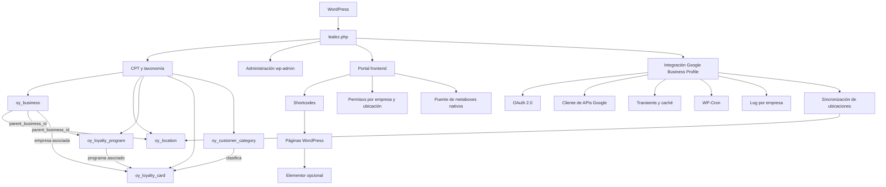
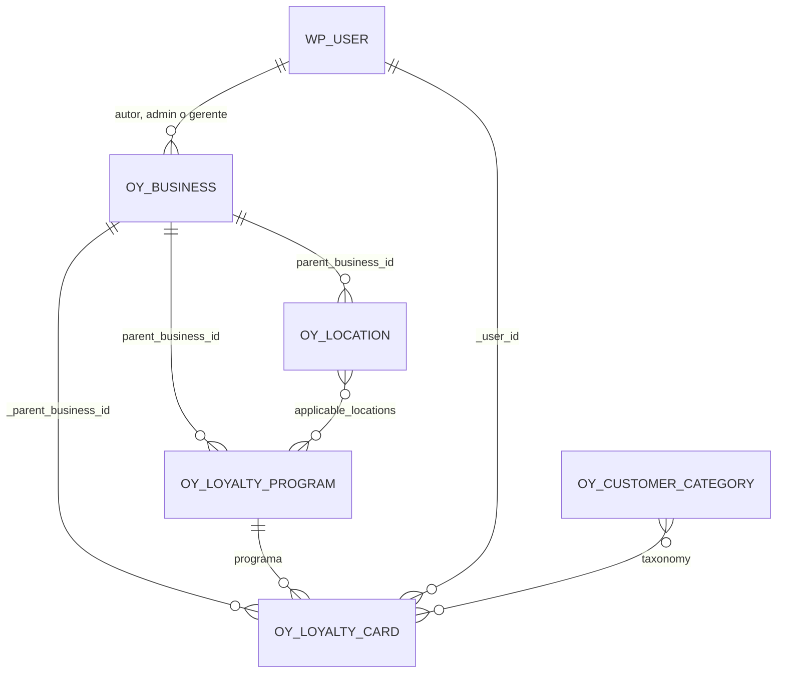
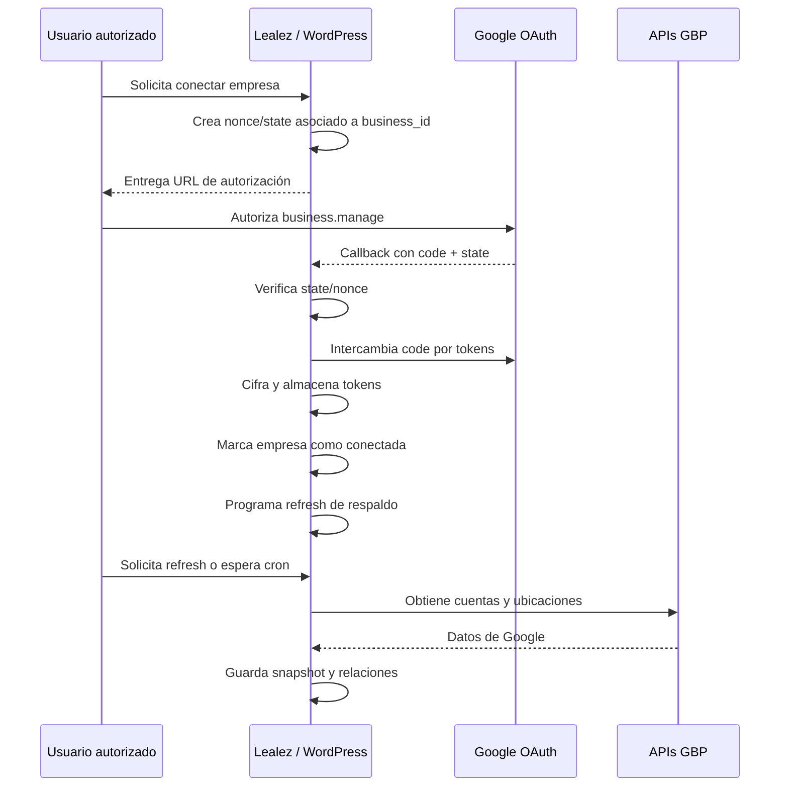

# Lealez

> Plugin de WordPress para administrar empresas, ubicaciones, perfiles de Google Business Profile y una base funcional de programas y tarjetas de lealtad.

[](https://wordpress.org/)
[](https://www.php.net/)
[](https://www.gnu.org/licenses/gpl-2.0.html)
[](#versionado)

## Tabla de contenido

- [Resumen ejecutivo](#resumen-ejecutivo)
- [Estado documentado](#estado-documentado)
- [Capacidades principales](#capacidades-principales)
- [Arquitectura general](#arquitectura-general)
- [Modelo de dominio](#modelo-de-dominio)
- [Estructura del repositorio](#estructura-del-repositorio)
- [Ciclo de carga del plugin](#ciclo-de-carga-del-plugin)
- [Entidades y almacenamiento](#entidades-y-almacenamiento)
- [Integración con Google Business Profile](#integración-con-google-business-profile)
- [Portal de administración frontend](#portal-de-administración-frontend)
- [Administración de WordPress](#administración-de-wordpress)
- [Instalación](#instalación)
- [Configuración de Google](#configuración-de-google)
- [Permisos y control de acceso](#permisos-y-control-de-acceso)
- [Procesos asíncronos, caché y límites](#procesos-asíncronos-caché-y-límites)
- [Seguridad y privacidad](#seguridad-y-privacidad)
- [Migración, despliegue y copias de seguridad](#migración-despliegue-y-copias-de-seguridad)
- [Guía de desarrollo](#guía-de-desarrollo)
- [Protocolo de control de cambios](#protocolo-de-control-de-cambios)
- [Checklist de regresión](#checklist-de-regresión)
- [Diagnóstico y solución de problemas](#diagnóstico-y-solución-de-problemas)
- [Consideraciones técnicas conocidas](#consideraciones-técnicas-conocidas)
- [Glosario](#glosario)
- [Licencia y mantenimiento](#licencia-y-mantenimiento)

---

## Resumen ejecutivo

Lealez es un plugin monolítico de WordPress orientado a dos áreas funcionales relacionadas:

1. **Gestión de presencia digital de empresas y ubicaciones**, con una integración profunda con Google Business Profile —denominado todavía “Google My Business” o “GMB” en varias clases, metadatos y acciones internas—.
2. **Gestión de lealtad**, mediante entidades para programas, tarjetas, saldos, titulares, categorías de clientes, alcance por ubicaciones y configuración de billeteras digitales.

El sistema utiliza WordPress como plataforma de datos y ejecución:

- Los objetos de negocio se almacenan como **Custom Post Types**.
- Las propiedades se almacenan principalmente como **post meta**.
- Las categorías de clientes utilizan una **taxonomía jerárquica** y **term meta**.
- La configuración global utiliza **options**.
- La caché, los límites de llamadas y algunos bloqueos utilizan **transients**.
- Los procesos diferidos y verificaciones utilizan **WP-Cron**.
- Las operaciones interactivas utilizan **AJAX de WordPress**, formularios protegidos con nonces y handlers `admin-post`.
- El portal de autogestión se publica mediante **shortcodes** en páginas normales de WordPress, compatibles con Elementor.

La arquitectura actual prioriza la compatibilidad hacia atrás. Existen convenciones históricas distintas entre módulos —por ejemplo, metadatos con y sin prefijo `_`— que deben conservarse mientras no exista una migración explícita y probada.

---

## Estado documentado

Este documento describe el estado del repositorio:

- **Repositorio:** `theleadpartner/lealez.com`
- **Rama base:** `main`
- **Commit de referencia:** rama `main`, versión funcional `1.3.0`
- **Fecha de revisión:** 30 de julio de 2026
- **Versión declarada en `lealez.php`:** `1.3.0`
- **Versión mínima de WordPress:** `6.0`
- **Versión mínima de PHP:** `7.4`
- **Text domain:** `lealez`
- **Licencia declarada por el plugin:** GPL v2 o posterior

> Este README debe actualizarse cuando cambien la arquitectura, los CPT, las meta keys, los shortcodes, las páginas frontend, los endpoints, los cron hooks, el modelo de permisos o los requisitos de instalación.

---

## Capacidades principales

### Empresas

- Registro de empresas o marcas.
- Identidad comercial y razón social.
- Tipo de negocio: una ubicación o múltiples ubicaciones.
- Descripción, industria, categoría y subcategoría.
- Identidad visual: logotipo, icono, portada, eslogan y colores.
- Contacto corporativo y sitio web.
- Redes sociales.
- Información fiscal y legal.
- Administradores y gerentes asociados.
- Preferencias de Google Business Profile y Google Wallet.
- Resumen de cuentas y ubicaciones importadas desde Google.
- Contadores y estadísticas agregadas.

### Ubicaciones

- Relación obligatoria con una empresa.
- Dirección, geolocalización y configuración para negocios de área de servicio.
- Información de contacto, teléfonos y URLs públicas.
- Horarios regulares y especiales.
- Estado operativo.
- Categoría principal y rango de precios.
- Responsables, notas y redes sociales.
- Configuración de lealtad por ubicación.
- Vinculación con una ubicación concreta de Google Business Profile.
- Importación y sincronización de datos.
- Medios y fotos del propietario.
- Menús para restaurantes.
- Servicios para negocios no restaurantes.
- Atributos dinámicos de Google.
- Publicaciones de Google.
- Reseñas y respuestas.
- Métricas de rendimiento.
- Frases clave de búsqueda.
- Estimación de horarios de mayor interés.
- Panel técnico con datos RAW y estado de integración.

### Programas de lealtad

- Relación con una empresa.
- Tipos de programa:
  - puntos;
  - sellos;
  - visitas;
  - cashback;
  - niveles;
  - híbrido.
- Moneda singular y plural.
- Estado operativo.
- Alcance:
  - global para todas las ubicaciones;
  - ubicaciones específicas;
  - una sola ubicación.
- Mecánica de acumulación y recompensas.
- Diseño de tarjeta.
- Estadísticas y contadores.

### Tarjetas de lealtad

- Relación con empresa, programa y usuario.
- Número de tarjeta generado automáticamente.
- Datos del titular.
- Saldo, puntos y nivel.
- Estado y vigencia.
- Códigos de barras.
- Ubicaciones relacionadas.
- Actividad y transacciones.
- Preferencias.
- Seguridad.
- Referidos.
- Campos para Google Wallet y Apple Wallet.
- Clasificación por categorías de cliente.

### Portal frontend

- Dashboard del usuario.
- Listado y edición de empresas.
- Archivo y restauración sin eliminar datos.
- Gestión del equipo de empresa.
- Preferencias de integraciones.
- Centro Google de empresa.
- Listado y edición de ubicaciones.
- Centro Google de ubicación.
- Edición del perfil personal y contraseña.
- Instalador administrativo de páginas y shortcodes.
- Compatibilidad con Elementor.
- Protección contra caché de páginas personalizadas por usuario.

---

## Arquitectura general



### Principios actuales

- **WordPress es la fuente de verdad local.**
- **La empresa es la unidad principal de propiedad y autorización.**
- **La ubicación es la unidad principal de operación con Google.**
- **La conexión OAuth se almacena por empresa.**
- **Los recursos de Google se vinculan a ubicaciones locales.**
- **El frontend reutiliza la lógica del administrador cuando esa lógica es crítica**, especialmente en Google Business Profile.
- **Archivar equivale a cambiar el estado del post a `draft`; no equivale a borrar.**
- **REST está deshabilitado en los CPT actuales.**
- **Los nombres de hooks, shortcodes, acciones AJAX, IDs de metabox y meta keys forman parte de la compatibilidad pública interna del plugin.**

---

## Modelo de dominio



### Jerarquía funcional

```text
Empresa
├── Equipo
│   ├── Autor/propietario
│   ├── Administradores
│   └── Gerentes
├── Conexión Google Business Profile
│   ├── Tokens
│   ├── Cuentas de Google
│   └── Ubicaciones disponibles
├── Ubicaciones locales
│   └── Perfil Google asociado
├── Programas de lealtad
│   └── Alcance por ubicaciones
└── Tarjetas de lealtad
    ├── Titular
    ├── Programa
    ├── Saldo
    └── Categorías
```

### Regla crítica de propiedad

Una ubicación local debe pertenecer a una empresa mediante `parent_business_id`. La autorización frontend se deriva de la capacidad del usuario para acceder a la empresa propietaria. Cualquier función nueva relacionada con ubicaciones debe validar primero esa relación y no confiar solamente en un `location_id` recibido por URL, formulario o AJAX.

---

## Estructura del repositorio

La siguiente vista muestra los componentes relevantes confirmados durante la revisión. No pretende sustituir el árbol real del repositorio.

```text
lealez.com/
├── lealez.php
├── assets/
│   ├── css/
│   │   └── frontend/
│   │       ├── lealez-frontend-portal.css
│   │       ├── lealez-frontend-gmb-center.css
│   │       └── lealez-gmb-admin-compat.css
│   └── js/
│       ├── admin/
│       │   └── lealez-gmb-connection.js
│       └── frontend/
│           ├── lealez-frontend-portal.js
│           └── lealez-frontend-gmb-center.js
├── includes/
│   ├── admin/
│   │   └── class-lealez-admin-menu.php
│   ├── cpts/
│   │   ├── class-oy-business-cpt.php
│   │   ├── class-oy-location-cpt.php
│   │   ├── class-oy-loyalty-program-cpt.php
│   │   ├── class-oy-loyalty-card-cpt.php
│   │   └── metaboxes/
│   │       ├── class-oy-business-gmb-snapshot-metabox.php
│   │       ├── class-oy-location-basic-info-metabox.php
│   │       ├── class-oy-location-address-metabox.php
│   │       ├── class-oy-location-contact-metabox.php
│   │       ├── class-oy-location-hours-metabox.php
│   │       ├── class-oy-location-menu-metabox.php
│   │       ├── class-oy-location-services-metabox.php
│   │       ├── class-oy-location-gmb-media-metabox.php
│   │       ├── class-oy-location-gmb-more-metabox.php
│   │       ├── class-oy-location-gmb-posts-metabox.php
│   │       ├── class-oy-location-gmb-reviews-metabox.php
│   │       ├── class-oy-location-gmb-performance-metabox.php
│   │       ├── class-oy-location-gmb-keywords-metabox.php
│   │       ├── class-oy-location-gmb-busyhours-metabox.php
│   │       └── class-oy-location-gmb-integration-metabox.php
│   ├── frontend/
│   │   ├── class-lealez-frontend-portal.php
│   │   ├── class-lealez-frontend-gmb-center.php
│   │   ├── lealez-frontend-pages-trait.php
│   │   ├── lealez-frontend-business-trait.php
│   │   ├── lealez-frontend-location-trait.php
│   │   ├── lealez-frontend-user-helpers-trait.php
│   │   └── lealez-frontend-admin-compat.php
│   ├── integrations/
│   │   └── google-my-business/
│   │       ├── class-lealez-gmb-settings.php
│   │       ├── class-lealez-gmb-oauth.php
│   │       ├── class-lealez-gmb-encryption.php
│   │       ├── class-lealez-gmb-rate-limiter.php
│   │       ├── class-lealez-gmb-logger.php
│   │       ├── class-lealez-gmb-api.php
│   │       └── class-lealez-gmb-ajax.php
│   └── taxonomies/
│       └── class-oy-customer-category-taxonomy.php
└── README.md
```

### Archivos de entrada principales

| Archivo | Responsabilidad |
|---|---|
| `lealez.php` | Bootstrap, constantes, activación, carga de componentes y versión. |
| `includes/admin/class-lealez-admin-menu.php` | Menú principal, dashboard y accesos administrativos. |
| `includes/cpts/class-oy-business-cpt.php` | Empresa, metaboxes, columnas y conexión GMB a nivel de empresa. |
| `includes/cpts/class-oy-location-cpt.php` | Ubicación, relaciones, métricas, módulos GMB y cron hooks. |
| `includes/frontend/class-lealez-frontend-portal.php` | Ensamblaje del portal y protección de páginas personalizadas. |
| `includes/frontend/class-lealez-frontend-gmb-center.php` | Adaptación de metaboxes GMB del backend al frontend. |
| `includes/integrations/google-my-business/class-lealez-gmb-api.php` | Transporte HTTP, caché, refresh, locks, rate limit y APIs de Google. |
| `includes/integrations/google-my-business/class-lealez-gmb-ajax.php` | Acciones AJAX, conexión, desconexión, refresh y callback OAuth. |

---

## Ciclo de carga del plugin

### Bootstrap

`lealez.php` implementa un singleton `Lealez_Plugin` y define:

```text
LEALEZ_VERSION
LEALEZ_PLUGIN_FILE
LEALEZ_PLUGIN_BASENAME
LEALEZ_PLUGIN_DIR
LEALEZ_PLUGIN_URL
LEALEZ_ASSETS_URL
LEALEZ_INCLUDES_DIR
LEALEZ_TEMPLATES_DIR
```

### Hooks principales

| Hook | Acción |
|---|---|
| `register_activation_hook` | Valida versiones, carga CPT, crea opciones, registra fecha/versión y limpia rewrites. |
| `register_deactivation_hook` | Limpia rewrite rules. |
| `plugins_loaded` prioridad `-1` | Carga CPT, integración Google, frontend y administración. |
| `init` prioridad `0` | Carga traducciones y dispara `lealez_init`. |
| `lealez_loaded` | Punto de extensión después de cargar componentes. |
| `lealez_activated` | Punto de extensión después de activar. |
| `lealez_deactivated` | Punto de extensión después de desactivar. |

### Orden de carga

1. Definición de constantes.
2. Registro de hooks de activación y carga.
3. Carga de CPT y taxonomía.
4. Carga condicional de las clases de Google.
5. Carga del portal frontend tanto en frontend como en administración.
6. Carga del menú administrativo solo en `is_admin()`.
7. Carga de configuración GMB si la clase OAuth está disponible.

### Opciones iniciales

```php
lealez_general_settings = [
    'plugin_enabled' => true,
    'debug_mode'     => false,
];

lealez_google_settings = [
    'gmb_enabled'           => false,
    'google_wallet_enabled' => false,
];

lealez_apple_settings = [
    'apple_wallet_enabled' => false,
];
```

Estas opciones representan configuración base. No se debe asumir que activar un flag equivale por sí solo a una integración completa.

---

## Entidades y almacenamiento

### Resumen de CPT

| CPT | Uso | Público | Queryable | Archivo | REST |
|---|---|---:|---:|---:|---:|
| `oy_business` | Empresa o marca propietaria | No | No | No | No |
| `oy_location` | Sucursal o perfil individual | Sí | Sí | Sí | No |
| `oy_loyalty_program` | Programa de lealtad | Sí | Sí | Sí | No |
| `oy_loyalty_card` | Tarjeta individual de usuario | No | No | No | No |

> `oy_location` y `oy_loyalty_program` son públicos y queryables. Antes de añadir información sensible a estas entidades se debe verificar qué plantillas, archives o consultas pueden exponerla.

### 1. Empresa — `oy_business`

**Clase:** `Lealez_Business_CPT`  
**Archivo:** `includes/cpts/class-oy-business-cpt.php`

Características:

- Soporta título, imagen destacada y autor.
- No es públicamente consultable.
- Se administra desde el menú Lealez.
- Centraliza la propiedad de ubicaciones, programas, tarjetas y conexión Google.
- Carga el snapshot de cuentas/ubicaciones Google como metabox externo.

Grupos principales de metadatos:

| Área | Ejemplos de claves |
|---|---|
| Identidad | `_business_name`, `_business_legal_name`, `_business_type`, `_business_description`, `_business_founded_date` |
| Marca | `_brand_logo`, `_brand_logo_id`, `_brand_icon`, `_brand_cover_image`, `_brand_tagline`, `_brand_colors` |
| Contacto | `_corporate_email`, `_corporate_phone`, `_corporate_website`, dirección corporativa |
| Clasificación | industria, categoría, subcategoría |
| Redes | Facebook, Instagram, X/Twitter, LinkedIn, YouTube, TikTok |
| Legal | identificación fiscal y datos legales |
| Equipo | `_admin_users`, `_manager_users` |
| Google | tokens, conexión, cuentas, ubicaciones disponibles, preferencias |
| Métricas | `_total_locations` y valores agregados |

**Regla de compatibilidad:** la mayoría de claves de empresa usan prefijo `_`. No retirar el prefijo ni duplicar una versión sin prefijo para “uniformar” el modelo.

### 2. Ubicación — `oy_location`

**Clase:** `OY_Location_CPT`  
**Archivo:** `includes/cpts/class-oy-location-cpt.php`

Características:

- Es la entidad operativa más compleja.
- Es pública, queryable y tiene archive.
- Soporta título, imagen destacada y autor.
- Se relaciona con la empresa mediante `parent_business_id`.
- Utiliza metaboxes independientes para reducir el tamaño del CPT.
- Agrega métricas a la empresa propietaria.
- Implementa sincronización con Google a nivel de campos y módulos.
- Mantiene prioridades de guardado específicas entre metaboxes.

Familias de datos:

| Área | Ejemplos |
|---|---|
| Relación | `parent_business_id` |
| Perfil | `location_code`, `location_status`, `location_short_description`, `opening_date` |
| Dirección | `location_address_line1`, `location_city`, `location_state`, `location_country`, coordenadas |
| Área de servicio | `service_area_only`, visibilidad de dirección y áreas |
| Contacto | `location_phone`, teléfonos adicionales, sitio web, email |
| Enlaces | reservas, pedidos, menú y place actions |
| Horarios | horarios regulares, cierres y horarios especiales |
| Google | nombre remoto, IDs, metadata RAW, estado de push/importación |
| Contenido | medios, publicaciones, menú, servicios y atributos |
| Reputación | reseñas, respuestas y estado de sincronización |
| Rendimiento | métricas diarias, keywords y horarios de interés |
| Lealtad | programa, responsables y ajustes locales |

**Regla de compatibilidad:** la ubicación combina claves sin `_`, claves con prefijo `gmb_` y claves auxiliares de sincronización. Esta mezcla es histórica y está consumida por PHP, JavaScript, AJAX y cron.

### 3. Programa — `oy_loyalty_program`

**Clase:** `OY_Loyalty_Program_CPT`  
**Archivo:** `includes/cpts/class-oy-loyalty-program-cpt.php`

Metadatos principales:

- `parent_business_id`
- `program_type`
- `program_status`
- `program_currency_name`
- `program_currency_plural`
- `program_scope`
- `applicable_locations`
- configuración de acumulación/recompensas;
- diseño de tarjeta;
- estadísticas agregadas.

El alcance debe respetar la empresa propietaria. Una ubicación incluida en `applicable_locations` debe pertenecer a la misma empresa del programa.

### 4. Tarjeta — `oy_loyalty_card`

**Clase:** `Lealez_Loyalty_Card_CPT`  
**Archivo:** `includes/cpts/class-oy-loyalty-card-cpt.php`

Metadatos y comportamientos:

- `_parent_business_id`
- `_user_id`
- `_card_number`
- datos del titular;
- saldo, puntos, nivel y estado;
- barcodes;
- billeteras;
- preferencias;
- seguridad;
- referidos;
- actividad.

El número de tarjeta se genera al crear el post. Los contadores del programa se actualizan al guardar o eliminar.

> Esta entidad puede contener información personal. Cualquier exportación, log, endpoint o nueva interfaz debe aplicar minimización de datos, autorización y escape de salida.

### 5. Categoría — `oy_customer_category`

**Clase:** `OY_Customer_Category_Taxonomy`  
**Archivo:** `includes/taxonomies/class-oy-customer-category-taxonomy.php`

- Taxonomía jerárquica.
- Asociada a `oy_loyalty_card`.
- No pública.
- Administración de términos restringida a `manage_options`.
- Asignación permitida a quien tenga `edit_posts`.

Term meta:

| Clave | Uso |
|---|---|
| `parent_business_id` | Empresa propietaria |
| `category_type` | `cumulative` o `restrictive` |
| `category_color` | Identificación visual |
| `category_description_extended` | Beneficios o explicación |

---

## Integración con Google Business Profile

### Terminología

El código conserva el prefijo `gmb` por compatibilidad histórica, aunque el nombre actual del producto es **Google Business Profile**. No renombrar clases, opciones, metadatos, acciones AJAX o hooks solo por actualizar la terminología visible.

### Componentes

| Clase | Responsabilidad |
|---|---|
| `Lealez_GMB_Settings` | Credenciales, instrucciones, test de APIs y configuración administrativa. |
| `Lealez_GMB_OAuth` | Autorización OAuth 2.0, intercambio y renovación de tokens. |
| `Lealez_GMB_Encryption` | Cifrado y descifrado de tokens. |
| `Lealez_GMB_Rate_Limiter` | Límite local y caché basada en transients. |
| `Lealez_GMB_Logger` | Historial funcional por empresa. |
| `Lealez_GMB_API` | Cliente HTTP y operaciones con APIs de Google. |
| `Lealez_GMB_Ajax` | Acciones AJAX y callback OAuth. |
| Metaboxes de ubicación | Importación, edición, push, verificación y analítica por módulo. |

### APIs y servicios usados por el código

- My Business Account Management API.
- My Business Business Information API.
- My Business Verifications API.
- My Business Place Actions API.
- Business Profile Performance API.
- My Business API v4 para operaciones todavía expuestas por endpoints v4, como medios.
- Places API (New) para búsqueda predictiva de áreas de servicio.
- OAuth 2.0 de Google.
- Endpoint de información de usuario de Google.

El scope OAuth solicitado es:

```text
https://www.googleapis.com/auth/business.manage
```

### Flujo de conexión



### Configuración OAuth

Opciones globales:

| Opción | Contenido |
|---|---|
| `lealez_gmb_client_id` | Client ID OAuth |
| `lealez_gmb_client_secret` | Client Secret OAuth |
| `lealez_places_api_key` | API key para Places API (New) |
| `lealez_gmb_encryption_key` | Clave local para cifrar tokens |
| `lealez_gmb_settings_test_log` | Historial de pruebas de configuración |

Redirect URI:

```text
{WP_ADMIN_URL}/admin.php?page=lealez-gmb-callback
```

La URI cambia cuando cambia el dominio, subdirectorio o URL administrativa. Debe actualizarse en Google Cloud durante una migración.

### Tokens

Los tokens se almacenan en post meta de la empresa:

- `_gmb_access_token`
- `_gmb_refresh_token`
- `_gmb_token_expires_at`
- `_gmb_token_type`
- `_gmb_token_scope`

El access token y refresh token se cifran con **AES-256-CBC**. La clave se genera con `random_bytes(32)` y se almacena en `lealez_gmb_encryption_key`.

Metadatos de estado:

- `_gmb_connected`
- `_gmb_connection_date`
- `_gmb_connected_by_user_id`
- `_gmb_account_email`
- `_gmb_account_name`
- `_gmb_oauth_state`

El token se considera próximo a expirar cuando faltan menos de cinco minutos y se intenta renovar antes de la solicitud.

### Desconexión

La desconexión:

1. elimina tokens;
2. elimina metadatos de conexión;
3. elimina snapshots de cuentas y ubicaciones;
4. limpia caché y flags de rate limit;
5. registra el evento.

No debe borrar la empresa ni las ubicaciones locales.

### Transporte HTTP

El cliente:

- utiliza `wp_remote_request`;
- aplica timeout de 45 segundos;
- incluye bearer token;
- serializa payloads como JSON;
- usa caché solo para GET;
- incluye query args en la clave de caché;
- distingue errores 403, 429, 5xx y 4xx;
- no reintenta agresivamente los rate limits;
- adjunta contexto técnico a `WP_Error`;
- redacta valores sensibles cuando escribe en `debug.log`;
- registra solicitudes y respuestas funcionales en el log de la empresa.

### Estrategia de sincronización

La conexión y la sincronización están separadas:

- El callback OAuth no descarga inmediatamente todo el perfil.
- Después de conectar, el usuario puede refrescar de forma manual.
- También se programa un refresh automático de respaldo.
- Las actualizaciones posteriores respetan cooldown, locks y rate limits.
- Los metaboxes especializados administran lectura, edición, push y verificación de su propio dominio.

### Módulos de ubicación

| Módulo | Función |
|---|---|
| Básico | Descripción, fecha de apertura, categoría y precio. |
| Dirección | Dirección, geocódigo, área de servicio y push. |
| Contacto | Teléfonos, sitio web, enlaces y push. |
| Horarios | Horarios regulares/especiales y push. |
| Medios | Fotos del propietario y recursos GBP. |
| Menú | Menús de restaurantes. |
| Servicios | Catálogo de servicios para otros negocios. |
| Más | Atributos dinámicos del perfil. |
| Publicaciones | Consulta, creación y eliminación de local posts. |
| Reseñas | Consulta, respuesta y eliminación de respuesta. |
| Rendimiento | Métricas diarias y comparativas. |
| Keywords | Frases de búsqueda mensuales. |
| Mayor interés | Índice estimado por día y distribución horaria. |
| Integración | Orquestación secuencial, cron, rate limit y log. |

### Acciones AJAX globales confirmadas

```text
lealez_gmb_get_auth_url
lealez_gmb_disconnect
lealez_gmb_refresh_locations
lealez_gmb_test_connection
lealez_gmb_clear_logs
lealez_gmb_create_location_from_gmb
lealez_gmb_run_settings_api_test
```

Acciones adicionales confirmadas en ubicación:

```text
oy_get_gmb_locations_for_business
oy_get_gmb_location_details
oy_sync_location_food_menus
oy_sync_location_hours_from_gmb
oy_sync_location_products
oy_gmb_posts_fetch
oy_gmb_posts_create
oy_gmb_posts_delete
oy_gmb_reviews_fetch
oy_gmb_reviews_reply
oy_gmb_reviews_delete_reply
oy_gmb_perf_fetch
oy_gmb_perf_keywords
oy_gmb_kw_fetch
oy_gmb_kw_save
oy_gmb_busy_compute
oy_gmb_busy_save
```

La lista puede crecer dentro de metaboxes especializados. Antes de añadir una acción, buscar colisiones en todo el repositorio.

---

## Portal de administración frontend

### Objetivo

Permitir que usuarios autorizados administren sus empresas, ubicaciones y perfil sin acceso directo a `wp-admin`.

### Ensamblaje

`class-lealez-frontend-portal.php` utiliza traits para separar responsabilidades:

| Trait | Responsabilidad |
|---|---|
| `Lealez_Frontend_Pages_Trait` | Páginas, shortcodes, instalador y URLs. |
| `Lealez_Frontend_Business_Trait` | Dashboard, empresas, equipo e integraciones. |
| `Lealez_Frontend_Location_Trait` | Listado y edición de ubicaciones. |
| `Lealez_Frontend_User_Helpers_Trait` | Perfil, router POST, sanitización y helpers. |

El centro GMB frontend reside en `Lealez_Frontend_GMB_Center`.

### Páginas y shortcodes

| Clave | Ruta prevista | Shortcode |
|---|---|---|
| `portal` | `/mi-cuenta-lealez/` | `[lealez_account_dashboard]` |
| `businesses` | `/mi-cuenta-lealez/mis-empresas/` | `[lealez_business_list]` |
| `business_editor` | `/mi-cuenta-lealez/editar-empresa/` | `[lealez_business_editor]` |
| `business_team` | `/mi-cuenta-lealez/equipo-empresa/` | `[lealez_business_team]` |
| `business_integrations` | `/mi-cuenta-lealez/integraciones-empresa/` | `[lealez_business_integrations]` |
| `business_google` | `/mi-cuenta-lealez/google-empresa/` | `[lealez_business_google_center]` |
| `locations` | `/mi-cuenta-lealez/mis-ubicaciones/` | `[lealez_location_list]` |
| `location_editor` | `/mi-cuenta-lealez/editar-ubicacion/` | `[lealez_location_editor]` |
| `location_google` | `/mi-cuenta-lealez/google-ubicacion/` | `[lealez_location_google_center]` |
| `user_profile` | `/mi-cuenta-lealez/mi-perfil/` | `[lealez_user_profile]` |

### Instalador de páginas

En **Lealez → Páginas frontend** se puede:

- crear una página individual;
- reparar una página que perdió el shortcode;
- crear o reparar todas;
- abrir la página;
- editarla;
- conservar el shortcode dentro de un diseño de Elementor.

Datos de control:

- option: `lealez_frontend_page_ids`;
- post meta: `_lealez_frontend_page_key`.

La detección no depende únicamente del ID guardado: si el ID ya no es válido, el sistema intenta localizar la página por ruta.

### Compatibilidad con Elementor

El contenido funcional está encapsulado en shortcodes. Elementor puede diseñar el contenedor y mantener el shortcode como widget o bloque de contenido.

Reglas:

- No sustituir el shortcode por HTML estático.
- No cachear la salida personalizada.
- No copiar formularios críticos a un widget independiente sin reutilizar handlers.
- Al cambiar una ruta, actualizar definición, navegación, instalador y documentación.

### Protección contra caché

Cuando una página tiene `_lealez_frontend_page_key`, el portal:

- define `DONOTCACHEPAGE`;
- define `DONOTCACHEOBJECT`;
- envía `nocache_headers()`.

Esta protección evita que un sistema de caché sirva datos de una empresa o usuario a otro. Cualquier nueva página personalizada debe registrarse mediante el mismo mecanismo.

### Router de acciones frontend

Los formularios envían `lealez_frontend_action`. Acciones confirmadas:

```text
save_business
archive_business
restore_business
save_business_team
save_business_integrations
save_location
archive_location
restore_location
save_user_profile
```

Todas deben:

1. requerir sesión;
2. verificar nonce;
3. validar propiedad/capacidad;
4. sanear campos;
5. mantener meta keys existentes;
6. redirigir con un estado de notificación.

### Archivo lógico

Empresas y ubicaciones se archivan cambiando `post_status` a `draft`. Al restaurar vuelven a `publish`.

No utilizar `wp_delete_post()` para implementar la acción “Archivar”.

### Centro GMB frontend

El centro GMB frontend reutiliza:

- callbacks de metabox;
- acciones AJAX;
- assets del módulo;
- jobs de push;
- verificación de estado;
- lógica de guardado nativa.

Para lograrlo añade:

- una capa mínima de compatibilidad de APIs de `wp-admin`;
- estilos compatibles para metaboxes;
- carga diferida de assets;
- mapeo de capacidades limitado al objeto;
- formulario puente para callbacks clásicos.

**Regla crítica:** no duplicar la lógica de Google en formularios frontend alternos. La paridad se conserva reutilizando el módulo administrativo.

---

## Administración de WordPress

Menú principal: **Lealez**

Submenús:

- Dashboard.
- Empresas.
- Ubicaciones.
- Programas de lealtad.
- Tarjetas de lealtad.
- Categorías de cliente.
- Configuración.
- GMB Settings.
- Páginas frontend.

El dashboard muestra:

- cantidad de empresas;
- cantidad de ubicaciones;
- cantidad de programas;
- cantidad de tarjetas;
- accesos rápidos;
- actividad reciente.

La administración principal utiliza `manage_options`. El portal frontend implementa permisos más granulares para usuarios no administradores.

---

## Instalación

### Requisitos

- WordPress 6.0 o posterior.
- PHP 7.4 o posterior.
- Extensión OpenSSL de PHP para cifrar tokens.
- HTTPS en producción.
- Permalinks funcionales.
- WP-Cron operativo o cron real que invoque `wp-cron.php`.
- Acceso saliente HTTPS hacia Google.
- Elementor es opcional; no es una dependencia del núcleo.

### Instalación manual

1. Copiar el plugin a:

   ```text
   wp-content/plugins/lealez/
   ```

2. Confirmar que el archivo principal sea:

   ```text
   wp-content/plugins/lealez/lealez.php
   ```

3. Activar **Lealez Plugin** desde WordPress.
4. Revisar **Lealez → Dashboard**.
5. Guardar nuevamente los enlaces permanentes si aparecen errores 404.
6. Configurar Google desde **Lealez → GMB Settings**.
7. Crear las páginas desde **Lealez → Páginas frontend**.
8. Probar acceso con:
   - administrador;
   - propietario de empresa;
   - administrador de empresa;
   - gerente;
   - usuario sin acceso.

### Activación

La activación:

- valida WordPress;
- valida PHP;
- carga los CPT;
- crea opciones predeterminadas si no existen;
- guarda timestamp y versión;
- ejecuta `flush_rewrite_rules()`.

La desactivación no borra datos.

---

## Configuración de Google

### APIs mínimas mostradas por el panel

En Google Cloud se deben habilitar:

- My Business Business Information API.
- My Business Account Management API.
- Places API (New), si se utilizará el autocompletado de áreas de servicio.

Los módulos adicionales pueden requerir acceso a Verifications, Place Actions, Performance y endpoints v4 de My Business.

### OAuth

1. Crear o seleccionar un proyecto.
2. Configurar la pantalla de consentimiento.
3. Agregar el scope `business.manage`.
4. Durante pruebas, agregar los correos como Test Users.
5. Crear un OAuth Client ID.
6. Agregar exactamente la Redirect URI mostrada por Lealez.
7. Guardar Client ID y Client Secret.
8. Conectar una empresa.
9. Ejecutar la prueba de APIs.
10. Ejecutar el primer refresh.

### Places API (New)

- Crear API key separada cuando sea posible.
- Restringirla a Places API (New).
- Mantenerla server-side.
- Aplicar restricción por IP cuando la infraestructura tenga IP saliente estable.
- Confirmar billing activo.
- No imprimirla en HTML, JavaScript público o logs.

### Pruebas de configuración

El panel GMB dispone de una prueba real que puede validar:

- Places API;
- Account Management API;
- Business Information API;
- credenciales guardadas;
- permisos;
- billing;
- restricciones;
- conexión OAuth existente.

El historial conserva hasta 20 ejecuciones del test.

---

## Permisos y control de acceso

### Backend

La mayoría de acciones administrativas globales y GMB requieren:

```text
manage_options
```

Los handlers AJAX globales verifican:

- nonce;
- capacidad;
- ID válido.

### Frontend

Roles funcionales por empresa:

| Perfil | Acceso esperado |
|---|---|
| Autor/propietario | Control de la empresa y sus ubicaciones. |
| Administrador de empresa | Equipo, integraciones, perfiles y ubicaciones. |
| Gerente | Edición operativa de perfiles y ubicaciones. |
| Usuario no asociado | Sin acceso. |
| Administrador WordPress | Acceso global según la capa administrativa. |

Los administradores y gerentes se guardan en:

```text
_admin_users
_manager_users
```

La interfaz de equipo recibe correos, resuelve usuarios existentes y conserva al autor como administrador.

### Reglas obligatorias para nuevas funciones

- Validar login.
- Verificar nonce.
- Confirmar tipo de post.
- Confirmar empresa propietaria.
- Confirmar relación ubicación → empresa.
- Confirmar capacidad específica.
- No aceptar un `business_id` o `location_id` como prueba de autorización.
- No devolver tokens, secretos o archivos de credenciales.
- No otorgar una capacidad global solo para hacer funcionar una pantalla frontend.
- Limitar cualquier elevación temporal al objeto y request actuales.

---

## Procesos asíncronos, caché y límites

### Límite local

`Lealez_GMB_Rate_Limiter` permite hasta:

```text
30 solicitudes por minuto por clave de endpoint
```

Se implementa con transients.

### Caché

El API client configura:

- cuentas: 24 horas;
- ubicaciones: 24 horas;
- otras respuestas GET: duración definida por el cliente.

La clave incluye:

- empresa;
- API base;
- endpoint;
- método;
- body;
- query args.

### Refresh manual

Intervalo mínimo:

```text
60 minutos
```

Metadatos relacionados:

```text
_gmb_last_manual_refresh
_gmb_last_rate_limit
_gmb_post_connect_cooldown_until
_gmb_next_scheduled_refresh
_gmb_last_scheduled_refresh
```

### Lock de sincronización

Transient:

```text
lealez_gmb_sync_lock_{business_id}
```

Metadatos:

```text
_gmb_sync_started_at
_gmb_sync_last_activity
```

El lock evita refresh concurrente entre usuario, cron u otro administrador. Incluye recuperación de locks sin actividad reciente.

### Cron principal de refresh

Hook:

```text
lealez_gmb_scheduled_refresh
```

Comportamiento:

- ejecución única;
- conserva el evento más próximo;
- respeta cooldown;
- reprograma después de rate limit;
- usa lock;
- registra resultados.

### Cron de verificación de pushes

```text
oy_poll_address_push_status
oy_poll_contact_push_status
oy_poll_hours_push_status
```

Estos hooks están registrados desde el CPT para estar disponibles incluso cuando WP-Cron se ejecuta fuera de `wp-admin`.

### Requisito operativo

En sitios con bajo tráfico, deshabilitar el pseudo-cron de visitas y configurar un cron del servidor que ejecute WordPress periódicamente. Verificar que no existan bloqueos HTTP o autenticación básica que impidan `wp-cron.php`.

---

## Seguridad y privacidad

### Protecciones implementadas

- Bloqueo de acceso directo con `ABSPATH`.
- Nonces en formularios y AJAX.
- Capabilities en operaciones administrativas.
- OAuth state asociado a empresa.
- Cifrado AES-256-CBC para access y refresh tokens.
- Renovación de tokens.
- Sanitización por tipo de dato.
- Escape de salida en interfaces.
- Redacción de secretos en el log técnico de GMB.
- Protección anti-caché del portal.
- Locks contra sincronización concurrente.
- URLs y correos saneados.
- Validación estricta de fechas en frontend.

### Datos sensibles

El sistema puede almacenar:

- credenciales OAuth globales;
- tokens Google por empresa;
- correos de cuentas conectadas;
- datos legales de empresas;
- información de contacto;
- reseñas y respuestas;
- información personal de titulares;
- fechas de nacimiento;
- teléfonos;
- ubicación y actividad;
- saldos y transacciones.

Aplicar:

- acceso mínimo necesario;
- cifrado de backups;
- retención definida;
- logs sin datos personales innecesarios;
- controles de exportación;
- política de eliminación;
- cumplimiento de la normativa aplicable.

### Consideración sobre la clave de cifrado

La clave de cifrado se guarda en la base de datos de WordPress. Esto facilita migraciones completas, pero una copia comprometida de toda la base puede incluir tanto la clave como los tokens cifrados.

Medidas recomendadas para operación:

- proteger la base de datos y backups;
- limitar lectura de options/postmeta;
- no exponer dumps;
- rotar/reconectar cuentas después de un incidente;
- considerar en el futuro una clave externa definida en entorno o `wp-config.php`, acompañada de una migración segura.

### Client Secret y API key

El Client Secret y Places API Key se guardan como options. Los inputs se muestran como password, pero eso no equivale a cifrado en reposo.

No incluir estas opciones en:

- tickets;
- capturas públicas;
- logs;
- fixtures;
- commits;
- exportaciones no cifradas.

### Caché de páginas

Nunca excluir la protección anti-caché sin reemplazarla por una solución equivalente y probada por usuario/sesión.

---

## Migración, despliegue y copias de seguridad

### Datos que deben migrarse

- archivos del plugin;
- tablas estándar de WordPress con posts y postmeta;
- users y usermeta;
- terms, term taxonomy, relationships y termmeta;
- options;
- medios adjuntos;
- eventos cron relevantes;
- configuración de URLs.

### Elementos críticos

| Elemento | Motivo |
|---|---|
| `lealez_gmb_encryption_key` | Necesaria para descifrar tokens existentes. |
| Tokens `_gmb_*` | Mantienen sesiones Google. |
| `lealez_frontend_page_ids` | Mapea páginas del portal. |
| `_lealez_frontend_page_key` | Identifica páginas y evita caché. |
| Relaciones `parent_business_id` | Mantienen propiedad y acceso. |
| `_admin_users` / `_manager_users` | Mantienen permisos por empresa. |
| Cron events | Mantienen verificaciones y refresh. |

### Cambio de dominio

Después de migrar:

1. actualizar URLs de WordPress;
2. guardar permalinks;
3. abrir GMB Settings;
4. copiar la nueva Redirect URI;
5. actualizar el OAuth Client en Google;
6. revisar restricciones de Places API;
7. ejecutar prueba de APIs;
8. probar refresh;
9. revisar WP-Cron;
10. reparar páginas frontend si es necesario.

### Páginas frontend

Las páginas son portables:

- pueden recrearse;
- pueden repararse si perdieron shortcode;
- la opción de IDs se reconstruye por ruta;
- el diseño de Elementor debe conservarse al reparar, porque el shortcode se agrega al contenido existente.

### Tokens después de una migración

Si se migra toda la base, incluida la clave, los tokens deberían seguir siendo descifrables. Si se pierde o reemplaza `lealez_gmb_encryption_key`, se deben reconectar las empresas.

### Backups mínimos

- Base de datos completa.
- `wp-content/uploads`.
- Plugin Lealez.
- Configuración de servidor/cron.
- Registro externo de la configuración de Google Cloud, sin guardar secretos en el repositorio.

---

## Guía de desarrollo

### Estilo

- Seguir WordPress Coding Standards cuando se modifique código.
- Usar funciones de WordPress para HTTP, opciones, metadatos, usuarios, cron y seguridad.
- Mantener el text domain `lealez`.
- Preparar textos visibles para traducción.
- Escapar en salida y sanear en entrada.
- No ejecutar lógica sensible al cargar el archivo.
- Mantener guards `ABSPATH`.
- Evitar clases globales con nombres genéricos.

### Compatibilidad PHP

El plugin declara PHP 7.4. No utilizar sintaxis posterior sin aumentar formalmente el requisito y revisar el entorno de producción.

Evitar sin evaluación:

- enums;
- readonly properties;
- constructor property promotion;
- union/intersection types;
- atributos;
- funciones disponibles solo en versiones nuevas.

### Meta keys

Antes de cambiar una clave:

1. buscar lecturas y escrituras en todo el repositorio;
2. revisar PHP, JS, AJAX, cron y frontend;
3. identificar datos existentes;
4. crear migración idempotente;
5. mantener lectura fallback;
6. probar rollback;
7. documentar la transición.

No hacer reemplazos masivos de:

```text
_business_*
parent_business_id
_gmb_*
gmb_*
location_*
program_*
_card_*
```

### Metaboxes

Al crear o extraer un metabox:

- conservar el ID anterior cuando reemplaza uno existente;
- no registrarlo dos veces;
- respetar prioridades de `save_post`;
- conservar `name`, IDs DOM y eventos JavaScript consumidos;
- verificar que funcione en backend y en el puente frontend GMB;
- cargar assets solo en la pantalla correspondiente;
- evitar colisiones de clase.

### AJAX

Cada handler debe:

```php
check_ajax_referer(...);
current_user_can(...);
absint/sanitize...;
validar propiedad;
wp_send_json_success/error(...);
```

Además:

- no registrar `wp_ajax_nopriv_*` para operaciones privadas;
- no confiar en datos del navegador;
- devolver errores accionables;
- no incluir secretos en respuesta;
- usar lock en operaciones de sincronización.

### Cron

Los callbacks deben poder ejecutarse sin pantalla administrativa ni usuario actual.

- Cargar la clase desde un punto disponible en cron.
- Hacer el proceso idempotente.
- Evitar duplicados con `wp_next_scheduled`.
- Usar argumentos estables.
- Liberar locks en `finally`.
- Registrar fallos.
- No depender de `$_POST`, `$_GET` o assets.

### APIs de Google

- Usar el cliente central.
- No crear llamadas `wp_remote_*` duplicadas en UI si el API class ya cubre el caso.
- Respetar caché y refresh interval.
- Diferenciar lectura de push.
- Propagar `WP_Error`.
- No reintentar 429 de forma agresiva.
- Redactar Authorization, tokens y secrets.
- Conservar fallback de read masks cuando exista.
- Probar con una empresa conectada y otra desconectada.

### Frontend

- Reutilizar helpers.
- Registrar una página en `get_page_definitions()`.
- Crear shortcode estable.
- Agregar protección de acceso.
- No romper el instalador.
- Probar con Elementor.
- Evitar caché.
- Mantener navegación de regreso y mensajes.
- Usar acciones POST centrales.

### Assets

El repositorio no declara actualmente una cadena de compilación mediante `package.json` ni dependencias PHP mediante `composer.json`. Los assets son consumidos directamente.

Por ello:

- no asumir build automático;
- no introducir código que dependa de transpilation sin agregar y documentar la cadena;
- mantener compatibilidad del JavaScript entregado;
- versionar assets con `LEALEZ_VERSION`;
- evitar cargar CSS/JS globalmente.

---

## Protocolo de control de cambios

### Objetivo

Reducir regresiones en un plugin con alto acoplamiento entre:

- CPT;
- meta keys;
- metaboxes;
- AJAX;
- cron;
- Google APIs;
- frontend;
- permisos;
- JavaScript.

### Flujo obligatorio

1. Crear rama desde `main`.
2. Usar un nombre descriptivo:

   ```text
   agent/<descripcion>
   ```

3. Analizar primero:
   - archivo objetivo;
   - funciones que lo llaman;
   - hooks;
   - meta keys;
   - acciones AJAX;
   - assets;
   - frontend/backend;
   - cron;
   - permisos.

4. Limitar cambios al alcance solicitado.
5. No borrar lógica “aparentemente antigua” sin verificar consumidores.
6. Realizar commits cohesivos.
7. Abrir pull request.
8. Documentar:
   - qué cambió;
   - por qué;
   - impacto;
   - compatibilidad;
   - pruebas;
   - riesgos;
   - rollback.

### Matriz de impacto recomendada

| Cambio | Revisar obligatoriamente |
|---|---|
| CPT | menú, queries, permisos, frontend, archives, counters |
| Meta key | lectura, guardado, AJAX, JS, cron, migración |
| Metabox | registro, prioridad, save, assets, frontend GMB |
| Acción AJAX | nonce, capability, propiedad, JS consumidor |
| Cron hook | registro global, args, duplicados, locks |
| API method | rate limit, cache, error handling, log |
| Página frontend | definición, shortcode, acceso, caché, Elementor |
| Equipo/permisos | autor, admins, managers, ubicación hija |
| OAuth | callback, redirect, tokens, desconexión |
| Assets | handles, dependencias, versión, pantalla objetivo |

### Compatibilidades que no se deben romper

- Slugs de CPT.
- IDs de metabox.
- Nombres de clases cargadas.
- Shortcodes.
- Acciones AJAX.
- Cron hooks.
- Query parameters `business_id` y `location_id`.
- Option `lealez_frontend_page_ids`.
- Post meta `_lealez_frontend_page_key`.
- Meta keys de relaciones.
- Estructura de entradas URL con `from_gmb`.
- Estados `publish`/`draft` usados para activo/archivado.
- Flujo de dos pasos OAuth → refresh.
- Puente de capacidades del centro GMB frontend.

### Commits

Formato recomendado:

```text
tipo: descripción breve
```

Tipos:

```text
feat
fix
refactor
docs
test
chore
security
```

Ejemplos:

```text
fix: prevent duplicate location sync jobs
feat: add frontend loyalty program editor
docs: document GMB migration requirements
```

### Pull request

Debe incluir:

- alcance;
- contexto;
- archivos modificados;
- comportamiento anterior;
- comportamiento nuevo;
- validación;
- compatibilidad;
- riesgos;
- instrucciones de despliegue;
- rollback.

### Cambios prohibidos sin proyecto específico

- Renombrar masivamente `GMB` a `GBP`.
- Normalizar todas las meta keys.
- Convertir CPT a tablas personalizadas.
- Activar REST.
- Cambiar visibilidad de CPT.
- Exponer tokens al frontend.
- Eliminar cooldown/rate limit.
- Sustituir WP-Cron por otra cola.
- Reescribir el portal en SPA.
- Cambiar el modelo de roles.
- Eliminar metaboxes considerados “legacy”.
- Cambiar versión mínima de PHP/WordPress.

---

## Checklist de regresión

### General

- [ ] El plugin activa sin error fatal.
- [ ] No se generan warnings/notices nuevos con `WP_DEBUG`.
- [ ] El menú Lealez carga.
- [ ] Los cuatro CPT aparecen.
- [ ] La taxonomía carga.
- [ ] Guardar permalinks no genera errores.
- [ ] No se modificaron datos fuera del alcance.

### Empresa

- [ ] Crear empresa.
- [ ] Editar cada grupo de metadatos.
- [ ] Imagen/logo no se pierde.
- [ ] Equipo conserva al autor.
- [ ] Administradores y gerentes se resuelven por correo.
- [ ] Archivar y restaurar.
- [ ] Contador de ubicaciones correcto.

### Ubicación

- [ ] Crear ubicación para empresa autorizada.
- [ ] Cambiar datos básicos.
- [ ] Guardar dirección.
- [ ] Guardar contacto.
- [ ] Guardar horarios.
- [ ] Guardar lealtad y responsables.
- [ ] Archivar y restaurar.
- [ ] No aparecen metaboxes duplicados.
- [ ] Prioridades de guardado conservan todos los campos.
- [ ] Cambio de empresa no rompe métricas.

### Google

- [ ] Configuración guarda credenciales.
- [ ] Test de APIs responde.
- [ ] OAuth abre.
- [ ] Callback valida state.
- [ ] Tokens se guardan y descifran.
- [ ] Refresh obtiene cuentas/ubicaciones.
- [ ] Segundo refresh respeta cooldown.
- [ ] Lock evita concurrencia.
- [ ] Cron se programa.
- [ ] Rate limit se maneja sin loop.
- [ ] Desconexión limpia estado sin borrar datos locales.
- [ ] Logs no muestran tokens.
- [ ] Push de dirección, contacto y horarios completa o reporta error.
- [ ] Reseñas/publicaciones/medios siguen funcionando.
- [ ] Performance y keywords cargan.

### Frontend

- [ ] Crear/reparar todas las páginas.
- [ ] Dashboard solo muestra datos accesibles.
- [ ] Usuario sin login ve solicitud de acceso.
- [ ] Usuario sin permisos recibe panel prohibido.
- [ ] Propietario administra su empresa.
- [ ] Gerente no recibe permisos de equipo no previstos.
- [ ] Empresa/ubicación de otro usuario no es accesible por ID manual.
- [ ] Formularios validan nonce.
- [ ] Elementor conserva shortcode.
- [ ] Caché no mezcla usuarios.
- [ ] Centro GMB frontend carga assets y callbacks.
- [ ] Perfil actualiza correo y contraseña correctamente.

### Lealtad

- [ ] Crear programa.
- [ ] Alcance global.
- [ ] Alcance por ubicaciones.
- [ ] Crear tarjeta.
- [ ] Número automático.
- [ ] Contadores del programa.
- [ ] Categorías acumulativas/restrictivas.
- [ ] Datos personales no aparecen públicamente.

### Despliegue

- [ ] Backup previo.
- [ ] Rama y commit identificados.
- [ ] Cambios limitados al PR.
- [ ] Caché purgada.
- [ ] Cron verificado.
- [ ] Redirect URI revisada si cambió URL.
- [ ] Rollback documentado.

---

## Diagnóstico y solución de problemas

### Error 403 de OAuth `access_denied`

Verificar:

- app en modo testing;
- usuario agregado como Test User;
- scope correcto;
- Client ID correcto;
- Redirect URI exacta;
- consentimiento no cancelado.

### Error 403 en APIs de Business Profile

Verificar:

- APIs habilitadas;
- proyecto correcto;
- cuenta Google con acceso al perfil;
- token vigente;
- permisos del perfil;
- acceso del proyecto a endpoints que requieren aprobación.

### Error 429 o `RESOURCE_EXHAUSTED`

- No repetir manualmente.
- Revisar `_gmb_last_rate_limit`.
- Revisar el cron programado.
- Esperar al menos el intervalo indicado.
- Confirmar que no existan requests duplicados.
- Revisar locks.
- Revisar log por empresa.

### “Sync already in progress”

- Esperar.
- Revisar transient `lealez_gmb_sync_lock_{business_id}`.
- Revisar `_gmb_sync_last_activity`.
- Confirmar que WP-Cron no esté detenido.
- No eliminar el lock mientras exista actividad real.

### OAuth conecta pero no muestra ubicaciones

- El callback no descarga todo de inmediato por diseño.
- Ejecutar refresh manual.
- Revisar refresh de respaldo.
- Revisar APIs.
- Revisar log.
- Confirmar acceso de la cuenta a perfiles.

### Áreas de servicio sin sugerencias

- Habilitar Places API (New).
- Configurar billing.
- Guardar API key.
- Revisar restricciones.
- Revisar IP saliente.
- Ejecutar test de APIs.

### Cron no se ejecuta

- Revisar `DISABLE_WP_CRON`.
- Configurar cron real.
- Revisar loopback.
- Revisar autenticación/WAF.
- Revisar eventos con WP-CLI.
- Confirmar que los callbacks se cargan fuera del admin.

### Portal muestra datos incorrectos o de otro usuario

Tratar como incidente de seguridad:

1. purgar caché;
2. verificar `_lealez_frontend_page_key`;
3. confirmar `DONOTCACHEPAGE`;
4. excluir rutas en CDN/proxy;
5. revisar permisos por empresa;
6. cerrar exposición antes de continuar.

### Página frontend no existe o perdió el shortcode

Usar:

```text
Lealez → Páginas frontend → Crear/Reparar
```

### Error fatal por clase duplicada

- Buscar el nombre en todo el repositorio.
- Verificar cargas repetidas.
- Usar `class_exists(..., false)`.
- Mantener nombres únicos.
- No incluir un metabox tanto desde CPT como desde otro bootstrap.

---

## Consideraciones técnicas conocidas

### 1. Diferencia de versión

`lealez.php` declara `1.1.0`, mientras componentes recientes del centro GMB frontend están documentados internamente con `@since 1.2.0`.

Antes del próximo release se debe:

- decidir versión efectiva;
- actualizar header;
- actualizar propiedad `$version`;
- actualizar changelog/README;
- verificar versionado de assets;
- guardar opción de versión mediante un proceso de upgrade.

### 2. No existe un sistema formal de upgrades

La activación crea opciones iniciales, pero no se observó un migrador versionado central para cambios de esquema de post meta/options.

Cualquier cambio de estructura debe introducir migraciones idempotentes y una versión de base de datos separada cuando sea necesario.

### 3. Convenciones de datos heterogéneas

- Empresa: principalmente `_business_*`.
- Ubicación: mezcla de `location_*`, `gmb_*`, `_gmb_*` y claves auxiliares.
- Programa: principalmente `program_*`.
- Tarjeta: principalmente claves con `_`.
- Relaciones: `parent_business_id` y `_parent_business_id` según entidad.

No es un error que pueda corregirse con búsqueda/reemplazo. Es deuda de compatibilidad.

### 4. CPT públicos con REST deshabilitado

Ubicación y programa son públicos/queryables, pero no REST. Revisar exposición por template/archive antes de almacenar contenido sensible.

### 5. Credenciales globales en options

Client Secret, Places API Key y clave de cifrado se almacenan en options. Los tokens sí están cifrados, pero la protección de secretos globales depende de la seguridad de WordPress y la base de datos.

### 6. Log funcional en post meta

El log GMB conserva 50 entradas por empresa. Es útil para soporte, pero no sustituye observabilidad central, auditoría inmutable ni métricas de infraestructura.

### 7. Rate limiter basado en transients

El límite es local a la instalación y depende del backend de options/object cache. No representa necesariamente las cuotas reales de Google ni coordina múltiples instalaciones.

### 8. WP-Cron depende de la infraestructura

La sincronización, reintentos y polling no son una cola independiente. Su puntualidad depende de WP-Cron o cron del servidor.

### 9. Frontend y backend están deliberadamente acoplados

El centro GMB frontend reutiliza callbacks del administrador. Esta decisión reduce divergencia, pero exige preservar compatibilidad con APIs, estilos y assets de `wp-admin`.

### 10. Integraciones de Wallet

Existen campos y configuración para Google Wallet y Apple Wallet. En el bootstrap revisado no se identificó una capa de API dedicada con profundidad equivalente a la integración GMB. Antes de prometer emisión o actualización automática de pases, verificar la implementación efectiva del flujo.

### 11. Sin manifiestos de dependencias o build

No se encontraron `composer.json`, `package.json` ni `.gitignore` en la raíz revisada. Los cambios deben asumir una distribución directa hasta que se formalice una cadena de desarrollo.

### 12. Licencia

El header declara GPL v2 o posterior, pero no se encontró un archivo `LICENSE` en la raíz durante esta revisión. Conviene agregarlo en un cambio documental separado.

---

## Glosario

| Término | Significado |
|---|---|
| Empresa | Entidad `oy_business`, propietaria de recursos y conexión Google. |
| Ubicación | Entidad `oy_location`, sucursal o perfil individual. |
| Programa | Entidad `oy_loyalty_program`. |
| Tarjeta | Entidad `oy_loyalty_card`. |
| GMB | Prefijo histórico para Google My Business. |
| GBP | Google Business Profile, nombre actual del producto. |
| Push | Envío de cambios locales hacia Google. |
| Import | Lectura de datos de Google hacia WordPress. |
| Snapshot | Copia local de cuentas/ubicaciones disponibles. |
| Metabox | Módulo de edición asociado a un CPT. |
| Lock | Bloqueo temporal que evita sincronizaciones concurrentes. |
| Cooldown | Ventana mínima antes de permitir otro refresh. |
| Portal | Páginas frontend de autogestión. |
| Archivo lógico | Cambio de estado a `draft`, sin eliminación. |
| Fuente de verdad local | Datos guardados en WordPress. |

---

## Licencia y mantenimiento

- **Autor declarado:** The Lead Partner
- **Sitio del plugin:** `https://lealez.com`
- **Licencia declarada:** GPL v2 o posterior
- **Text domain:** `lealez`

Este repositorio contiene lógica sensible de negocio, credenciales y datos personales. Los cambios deben realizarse mediante ramas y pull requests, con revisión del impacto y pruebas de regresión.

### Regla final para colaboradores y agentes

Antes de modificar una función:

1. leer el archivo completo;
2. localizar todos sus consumidores;
3. revisar entidades relacionadas;
4. revisar hooks, AJAX, cron y assets;
5. identificar compatibilidad frontend/backend;
6. conservar funciones fuera del alcance;
7. documentar el cambio;
8. validar el flujo completo.

La prioridad es extender Lealez sin destruir compatibilidad ni datos existentes.


---

<!-- LEALEZ_UNIFIED_LOCATION_PROFILE_1_3_0 -->
### Perfil unificado de ubicación — versión 1.3.0

Desde la versión `1.3.0`, una ubicación tiene **un único perfil frontend**. La página `Editar ubicación`, publicada mediante `[lealez_location_editor]`, reúne en la misma navegación:

- datos administrativos internos de Lealez;
- vinculación y control de sincronización con Google Business Profile;
- información básica, dirección, áreas de servicio, contacto y horarios;
- atributos de la sección “Más”;
- fotos, menú, servicios y publicaciones;
- opiniones y respuestas;
- rendimiento, frases de búsqueda y horario de mayor interés.

La página que antes se generaba como `Google de ubicación` ya no forma parte del instalador. Cuando existe en una instalación actualizada, se conserva como ruta de compatibilidad y redirige a `Editar ubicación`, preservando `location_id` y el módulo solicitado. No se elimina automáticamente para evitar romper enlaces, menús o marcadores existentes.

#### Leyenda de sincronización

Cada sección muestra uno de los siguientes alcances:

| Indicador | Significado |
|---|---|
| **Sincroniza con Google** | El módulo guarda primero en Lealez y dispone de un flujo de envío a Google Business Profile. |
| **Datos de Google** | Información obtenida desde Google; puede guardarse como caché o snapshot local, pero Google es la fuente. |
| **Solo Lealez** | Información administrativa que nunca se incluye en solicitudes a Google. |
| **Mixto** | La misma sección contiene campos de Google y campos locales; el panel enumera cada grupo. |
| **Control técnico** | Vinculación, límites, logs o coordinación del proceso; no representa contenido público del perfil. |

En la creación inicial, los campos compatibles también reciben una etiqueta visual. La ubicación debe guardarse primero para obtener un ID seguro; después continúa en el mismo perfil unificado y se habilitan los módulos de envío y verificación.

#### Estados de publicación

Guardar un formulario en WordPress **no significa** que el cambio ya esté publicado en Google. Los módulos compatibles mantienen el flujo:

1. editar el dato;
2. guardar localmente;
3. enviar a Google Business Profile;
4. verificar el estado devuelto por Google.

La interfaz diferencia los estados `Guardado · falta enviar`, `Enviado · en cola`, `Google está revisando`, `Aplicado en Google`, `Aplicado parcialmente`, `No aplicado`, `Google devolvió otro valor`, `Pendiente de verificación`, `Requiere corregir datos` y `Error de envío`.

Google conserva la decisión final. Una solicitud puede aplicarse inmediatamente, quedar en revisión, aplicarse parcialmente, ser modificada o ser rechazada. Lealez solo presenta `Aplicado en Google` cuando el verificador del módulo lo confirma.

#### Separación de campos

Los campos exclusivamente internos incluyen, entre otros:

- empresa propietaria y nombre interno de la ficha;
- código y estado administrativo;
- configuración de lealtad;
- responsable, correo, teléfono y notas internas.

Los módulos de dirección, contacto público, horarios, atributos y menú reutilizan los metaboxes originales y sus handlers AJAX, nonces, jobs, logs y verificadores. Las secciones mixtas detallan cuáles campos participan en el intercambio con Google y cuáles permanecen solo en Lealez.

#### Compatibilidad y permisos

- No se duplican meta keys ni se crea una segunda lógica de publicación.
- No se modifican los archivos de los CPT ni de los metaboxes existentes.
- Los permisos se calculan por empresa y ubicación.
- Los gerentes y administradores autorizados no reciben `manage_options` global.
- La vinculación crítica de la propiedad de Google permanece protegida.
- Las páginas personalizadas siguen excluidas del caché de página completa.
- La página `Google de empresa` continúa separada porque administra OAuth, cuentas y propiedades de la empresa, no el contenido de una ubicación individual.
